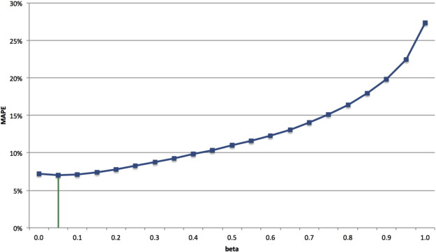

# XSM Project
Improving project forecast accuracy by integrating earned value
management with exponential smoothing and reference
class forecasting



## Requirements
- Python 3
- numpy
- matplotlib
- pandas

## Installation
```
pip install -r requirements.txt
```

## Usage example
Run main.py file

```sh
python main.py C2013-12
```

## Release History

* k60 - version (static and dynamic approach)
* k61 - version (implement Reference Class)


## Author
1. k60 - KSTN Hust
2. k61 - CNPM Hust (Team 3)
